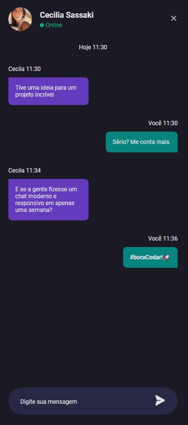

# Bora Codar - Desafio 03

<h1 align="center"> Chat </h1>

O projeto "Chat" foi desenvolvido durante no Bora Codar Rocketseat. Realizei o projeto durante a resolução do desafio. Trata-se de um projeto de um chat, sendo trabalhados diversos conceitos de responsividade e mobile first.  

  

## 🚀 Tecnologias

Esse projeto foi desenvolvido com as seguintes tecnologias:

- HTML e CSS
- Git e Github
- Figma
obs.: há uma pequena utilização de JavaScript, apenas para deixar visível as última mensagens enviadas. 

[Acesse o projeto finalizado, online](https://marcelgava.github.io/stage03-projeto03/)
